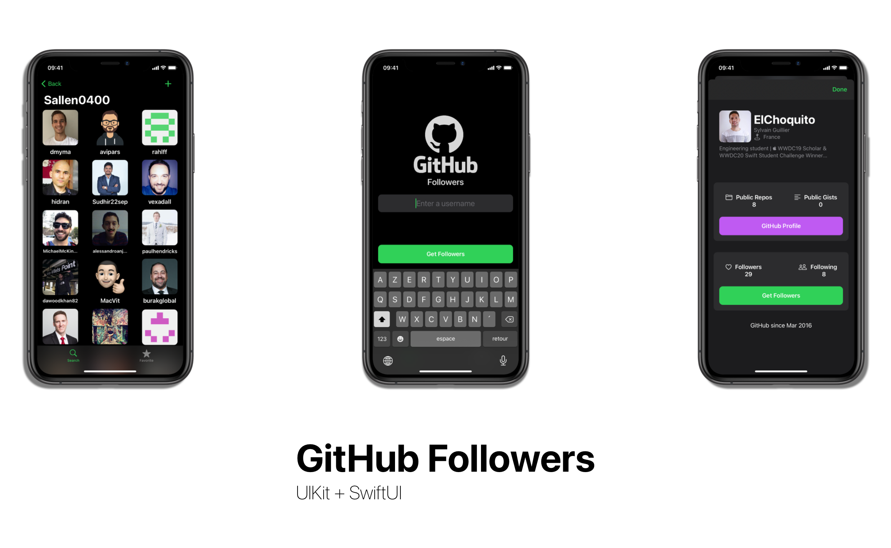

# GHFollowers

GHFollowers is [Sean Allen's Swift take home project course](https://seanallen.teachable.com/p/take-home).

## Introduction
This project includes two apps, GHFollowers and GHFollowers-SwiftUI.

The aim was at first to follow Sean Allen's Swift take home project course in order to build GHFollower with UIKit.

Then, add features like Localization, Dynamic Type and VoiceOver and changed some part of the code.

Finally, build the same app, but in SwiftUI.

## Requirements

### UIKit Version
- iOS 13.0+
- Xcode 11+
- Swift 4.2+

### SwiftUI Version
- iOS 14.0+
- Xcode 12+
- Swift 5+

## Features
- [x] Localization
- [x] Dynamic Type
- [x] VoiceOver

## Todo
- [ ] Add followers search filtering for SwiftUI version

## Discussion
### SwiftUI Version

@StateObject is used sometimes instead of @ObservedObject combined with dependency injection in order to let the view own the view model.

[Apple Documentation](https://developer.apple.com/documentation/swiftui/managing-model-data-in-your-app)

[Article about @StateObject](https://www.hackingwithswift.com/quick-start/swiftui/what-is-the-stateobject-property-wrapper)

[Solution used](https://stackoverflow.com/a/64964423)

## Contact

Any comments, feedback or whatever, please feel free to send me an [email](mailto:sylvainguillier@icloud.com).

[www.sylvainguillier.com](www.sylvainguillier.com)

